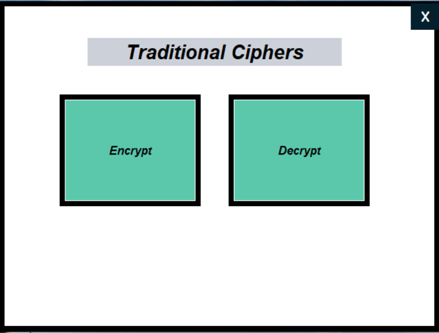
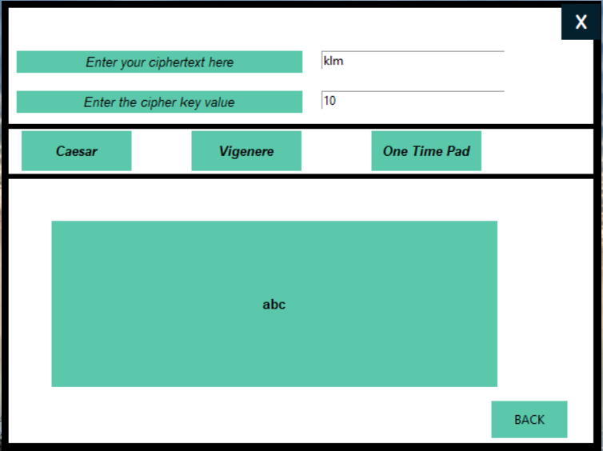

<h1> Encrypt-and-Decrypt-using-GUI</h1>

This is a very basic application which can be used to encrypt/decrypt in traditional cipher methods such as the Caesar cipher, Vignere cipher and One Time Pad. For the GUI I have used Tkinter library of python to design the application

<h3>How to run the application?</h3>

Run the GUI.py file Cipher_func.py contains the cipher functions.

 
<h3>Landing Page</h3>

  
<h3>Encryption with the Caesar cipher</h3>

  
<h3>Decryption with the Caesar cipher</h3>

